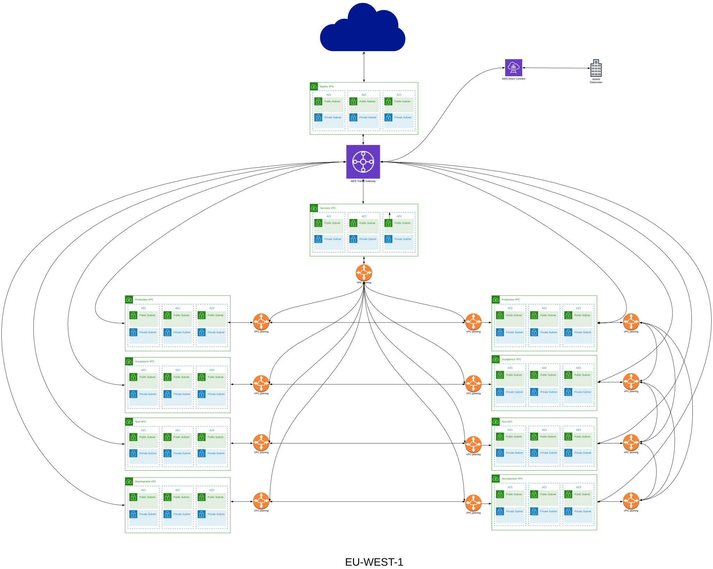

# Environmental VPC with shared subnets Design Pattern.
This module implements a regional network with multiple VPCs per environment and shared subnets. It is based on terraform modules that are orchestrated as layers of functionality by terragrunt.
The independent modules do not really make much sense in isolation as they are designed to deliver a full working networking following a specific network design that deals with specific requirements.
Thus this module is a very opinionated implementation of the following design. 

## Principles

### VPCs per environment

The pattern utilizes a VPC per invironment for development, test, acceptance and production. 
Each VPC will have public and private subnets as is described by AWS networking best practices.
Those subnets will be shared through Resource Access Manager and all workloads deployd in a landing
zone with this networking will get access to the subnets per their respective environment and deploy 
resources based on the subnet sharing design. [Shared Subnets Documentation.](https://docs.aws.amazon.com/vpc/latest/userguide/vpc-sharing.html)

### Mesh VPCs

The concept of a mesh VPC is an environmental VPC that is peered to other VPCs not of the same environment.
Example: Client states that it is important that a development system has network connectivity to a production system.
         
This networking pattern is generally not advised but is often a hard business requirement often seen as a hard requirement for SAP systems, 
therefore this optional set of VPCs can be deployed so systems requiring this capability can be somewhat isolated from other standard systems.

### Service VPC
    
This VPC type implements a common 'shared services' pattern. Its features include peering to all other VPCs in the 
landscape and will also house features like dns resolvers that provide services region wide to the full network. 

The workloads that will be flagged as services will have their production account use the Services VPC for their resources.

Effectively what that means is that from the workload's perspective they always have up to four environments: Development, 
Test, Acceptance and Production with the production being isolated in case of "normal" workloads and connected to everything
in case of a "service" workload. A good example for a "service" workload would be ansible [AWX](https://github.com/ansible/awx) / 
[Tower](https://www.ansible.com/products/tower) that would need to be able to execute ansible scripts across all possible environments 
or a hosted AD that would provide domain joins across environments.

### Transit gateway
    
An AWS transit gateway that provides all regional interconnectivity/on-prem connectivity and handles all transport
of egress traffic towards the egress VPC. All inter-region connectivity is handled by the VPCs and their peering according 
to their environment, with all same environment VPCs (isolated and meshed) peered and routed between them, all mesh VPCs peered
and routed between them and the services VPC being peered and routed to all the other ones. If traffic is not bound to any of those
endpoints it will be forwarded to the transit gateway that will handle it accordingly.
    

### Egress VPC
    
A VPC designed for the express purpose of handling and centralizing all egress traffic from the private subnets 
in the network landscape. 

### Dns Resolvers

Optional Route53 resolvers that function in the [OUTBOUND](https://docs.aws.amazon.com/Route53/latest/DeveloperGuide/resolver-forwarding-outbound-queries.html)
direction to provide DNS forwarding capability for VPCs to non native resolvers (useful in hybrid deployments). 
Optional Route53 resolvers that function in the [INBOUND](https://docs.aws.amazon.com/Route53/latest/DeveloperGuide/resolver.html) 
direction to provide dns resolving capabilities for foreign systems. (useful in hybrid deployments, 
working as an upstream forwarder for an Active directory deployment, for example)

## Relation to the code

### VPC creation and peering

From the points above the VPCs per environment, the Meshed VPCs, and the Service VPC are handled by the [vpc-layout](./vpc-layout/README.md) 
module. That expects input as specified in the example [layout.hcl](./example/layout.hcl) and [connectivity.hcl](./example/connectivity.hcl) 
which is used by the terragrunt code at [vpc-layout](./example/vpc-layout/terragrunt.hcl).

The peering and the routing for the VPCs according to the design are handled by the [vpc-peering-routing](./vpc-peering-routing/README.md) 
module which is used by the terragrunt code at [vpc-peering-routing](./example/vpc-peering-routing/terragrunt.hcl)

## Transit gateway, external routing and egress flows

The transit gateway, along with the egress VPC is handled by [external-connectivity](./external-connectivity/README.md) module
which is used by the terragrunt code at [extrenal-connectivity](./example/external-connectivity/terragrunt.hcl). 
The terragrunt module is using as input the variables specified at [connectivity.hcl](./example/connectivity.hcl) 

The routing for external domains and the egress flow is managed by [external-connectivity-egress-routing](./external-connectivity-egress-routing/README.md)
module which is used by the terragrunt code at [external-connectivity-egress-routing](./example/external-connectivity-egress-routing/terragrunt.hcl) 
which uses inputs from both [layout.hcl](./example/layout.hcl) and [connectivity.hcl](./example/connectivity.hcl).

## DNS Forwarders

The DNS forwarders, OUTBOUT and INBOUND are handled by [dns-resolvers](./dns-resolvers/README.md) module which is used by the 
terragrun code at [dns-resolvers](./example/dns-resolvers/terragrunt.hcl) and uses input from both [layout.hcl](./example/layout.hcl)
and [resolving.hcl](./example/resolving.hcl)

The association of the forwarding resolvers is managed by [dns-resolvers-associations](./dns-resolvers-associations/README.md) 
that is used by the terragrunt code at [dns-resolvers-associations](./example/dns-resolvers-associations/terragrunt.hcl) 
which uses input from both [layout.hcl](./example/layout.hcl) and [resolving.hcl](./example/resolving.hcl)

## Submodules

All the above modules depend and use modules that exist under [modules](./modules) that solve domain specific problems for the design. 

## Usage

Under [examle](./example) there is a fully functional structure for eu-west-1 region with default values. Edit accordingly for specific details.

## Caveats

The code implements a very specific design as explained and thus is very opinionated. 
Currently some things that could be optional like enabling or disabling the egress VPC along with disabling or enabling 
the per VPC nat gateways accordingly are not implemented as such. So the current code implements the design as is without much 
optionality that will be implemented in time. 

Assumptions used:

* A Services VPC is always used.
* Egress VPC is deployed, routing is applied for egress for all VPCs through that and the nat gateways of all the private subnets of all
the VPCs will not be deployed.
  
* Only two VPCs with the same environment can exist in the layout, one segregated and one mesh. Terraform does not provide anyway to do
variable validation depending on other variables so checking for wrong input is not possible to do so the care for the proper layout variable
  setting is the user's responsibility.
  
* The environments supported are development, test, acceptance and production.

If the above caveats are taken into consideration the code should be able to handle different number of VPCs from the design automatically.

